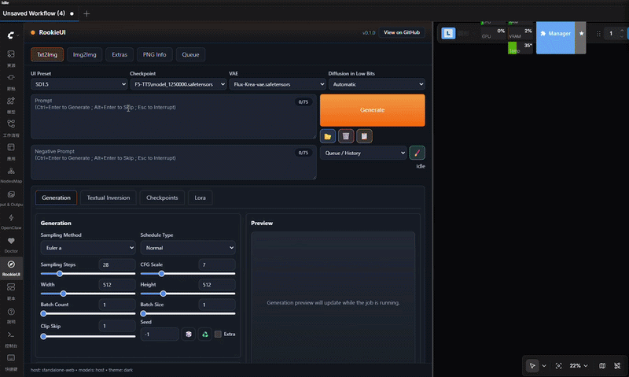
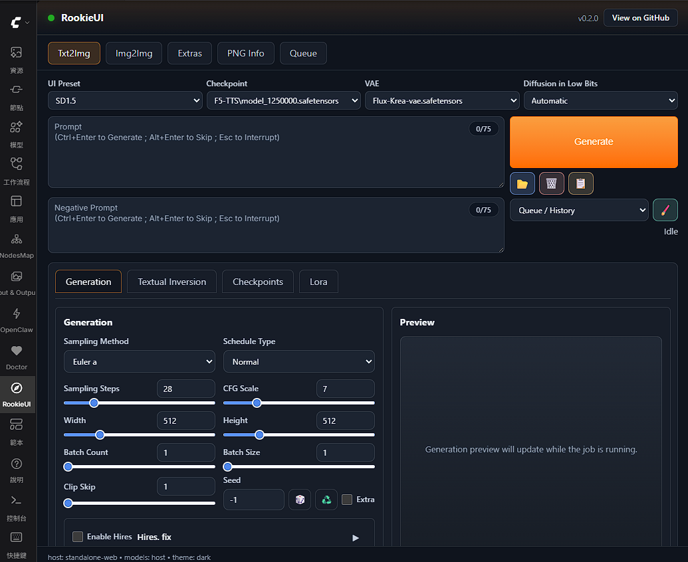
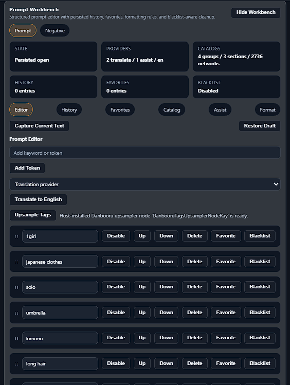
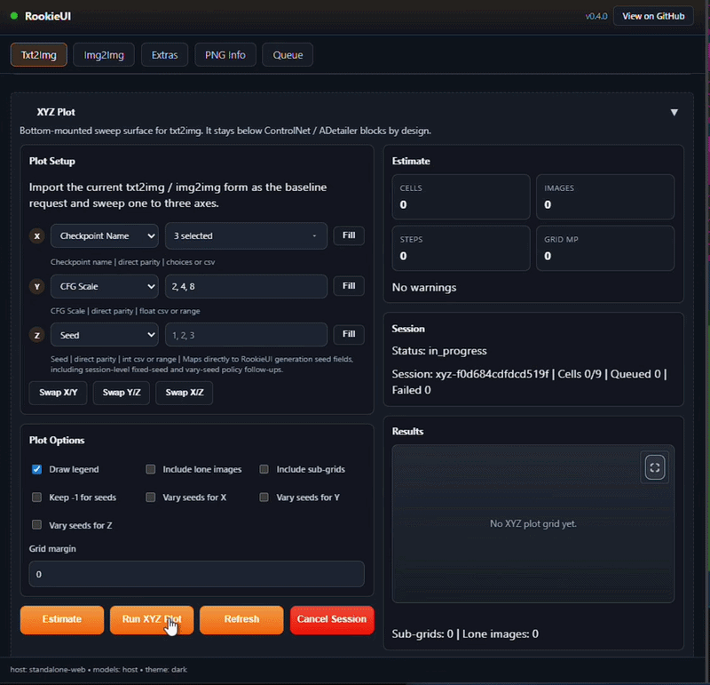
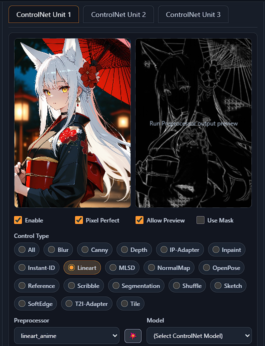
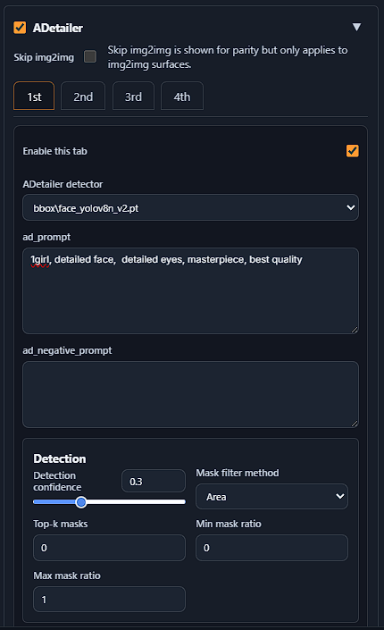

# ComfyUI-RookieUI
<br>

<div align="center">
  
</div>

<br>

ComfyUI-RookieUI is a ComfyUI custom node extension that reproduces an A1111-style sidebar workflow while keeping inference inside native ComfyUI execution. **The project target is not only visual similarity.** RookieUI aims to reproduce A1111-style workflow semantics for Stable Diffusion in a ComfyUI host:

- **prompt / negative prompt parsing and conditioning behavior**
- **sampler / scheduler / seed / CFG mapping**
- **img2img, inpaint, and extras postprocessing flows**
- **integrated ControlNet and ADetailer behavior**
- **PNG metadata round-trip and apply workflow**
- **Prompt Workbench authoring tools and XYZ Plot sweep sessions**
- **queue / progress / result UX and host-embedded validation coverage**

<br>

The core objective of this project is not merely to replicate the classic UI/UX, but to faithfully reproduce A1111's unique prompt parsing capabilities and image generation characteristics for the Stable Diffusion model family to the greatest extent possible. Even so, RookieUI supports more than just the Stable Diffusion family.

<details><summary><h2>Last Update - Click to expand</h2></summary>

<details>

<summary><strong>Official non-SD template preset expansion and truthful host gating (new functionality/stability)</strong></summary>

- Expanded RookieUI's non-SD preset matrix to the official ComfyUI text-to-image templates currently tracked in `reference/workflow_templates`, including `Anima`, `Chroma`, `ERNIE-Image`, `ERNIE-Image Turbo`, `Flux.1 Dev FP8`, `Flux.2 Klein` variants, `HiDream i1` variants, `Longcat BF16`, `Qwen-Image 2512`, `Z-Image`, and `Z-Image Turbo`.
- Aligned runtime translation to official non-SD topology and parameter semantics instead of generic fallback graphs, including family-specific `Shift`, `Flux Guidance`, `Prompt Enhancement`, and template-owned hidden encoder bundles where the official workflows require them.
- Tightened live-host catalog validation so official non-SD presets only pass when the active ComfyUI host exposes the required family-aligned models and template assets; missing host assets are now reported as external prerequisites instead of silently accepted fallback matches.
- Completed restarted-host catalog/execute proof for the current asset-ready official non-SD subset: `Anima`, `ERNIE-Image`, `ERNIE-Image Turbo`, `Flux.1 Dev FP8`, `Z-Image`, and `Z-Image Turbo`.

</details>

<details>

<summary><strong>Prompt Workbench Danbooru host-action integration (new functionality/stability)</strong></summary>

- Added a truthful `Upsample Tags` editor-toolbar action to `Prompt Workbench`, backed by a dedicated RookieUI `/rookieui/prompt-tools/upsample` route and host-node detection against the active ComfyUI registry.
- The new action applies returned prompt text back into the active `Prompt Workbench` draft and bound prompt input without changing existing translation, AI-assist, history/favorites, or formatting behavior.
- When the host-side Danbooru upsampler node is missing or unavailable, RookieUI now reports explicit disabled-state and route-level `host-unavailable` behavior instead of implying the action is always present.
- Prompt Workbench live-host validation now covers the Danbooru host-action path, and restarted-host `full-pipeline` report/execute acceptance now includes the prompt-workbench lane.

</details>

<details>

<summary><strong>Stateful-surface durability and live-host freshness hardening (stability/tooling)</strong></summary>

- Hardened `Prompt Workbench` and `XYZ Plot` persisted state with atomic JSON writes and corrupt-state quarantine instead of silent reset-on-parse-failure behavior.
- Added `XYZ Plot` async session-state coordination and bounded stale-session pruning so long-running hosts keep queue-backed sweep state consistent without unbounded retained history.
- Added backend runtime build fingerprint metadata on RookieUI bootstrap/capability payloads and a live-host freshness hard gate in `scripts/run_live_smoke_tests.py`.
- Live-host acceptance now refuses stale or not-yet-restarted ComfyUI processes before any validation lane executes, then revalidates `full-pipeline` report/execute on the restarted in-sync host.

</details>

<details>

<summary><strong>Prompt Workbench and XYZ Plot delivery (new functionality/stability)</strong></summary>

- Shipped an integrated `Prompt Workbench` in the `txt2img` and `img2img` prompt band, with persisted prompt/negative namespaces, quick-insert catalogs, translation tooling, AI assist delivery, history/favorites, and blacklist-aware formatting.
- Shipped a built-in `XYZ Plot` sweep surface for `txt2img` and `img2img`, including axis registry, estimate checks, queue-backed session runs, main-grid/sub-grid assembly, primary-preview synchronization, fullscreen result inspection, and metadata-aware result delivery.
- Added recent `XYZ Plot` parity follow-ups for choice-axis multiselect entry, running partial-grid preview delivery, A1111-style seed-policy controls (`Keep -1 for seeds` plus per-axis seed variation toggles), and output mirroring for assembled grids.
- Added dedicated live-host smoke lanes for `Prompt Workbench` and `XYZ Plot`, so route/state/session behavior is validated against the restarted ComfyUI host before acceptance.

</details>

<details>

<summary><strong>Extensibility refactor and architecture hardening (stability/maintainability)</strong></summary>

- Extracted shared workflow graph builders into `rookieui/services/workflow_builders/*`, keeping `workflow_translation.py` as the stable orchestration façade instead of a regrowing graph monolith.
- Split `ControlNet` and `ADetailer` backend ownership into focused catalog, normalization, runtime/refinement, and warning modules behind stable route-facing façades.
- Added backend/frontend integrated feature registries so sidebar bootstrap ownership and validation-lane linkage no longer depend on ad-hoc one-off wiring.
- Added manifest-backed architecture guardrails, import-cycle checks, façade size budgets, and final live-host `full-pipeline` validation to keep the refactor honest as these high-churn surfaces continue to expand.

**Architecture**

```text
ComfyUI process (single runtime)
|
+- ComfyUI core
|  +- native routes (/prompt, /history, /view, /ws, ...)
|  +- execution engine and model runtime
|
+- ComfyUI-RookieUI custom node package
   +- frontend sidebar shell + bootstrap registry
   |  +- web/rookieui_extension.js
   |  +- web/rookieui_feature_registry.js
   |  +- web/rookieui_sidebar_shell.js
   |
   +- internal routes under /rookieui/*
   +- stable backend facades
   |  +- workflow_translation.py
   |  +- controlnet.py
   |  +- adetailer.py
   |
   +- extracted backend ownership seams
   |  +- workflow_builders/*
   |  +- controlnet_* modules
   |  +- adetailer_* modules
   |  +- integrated_feature_registry.py
   |
   +- workflow submission into host ComfyUI queue
   +- live-host validation lanes for prompt parity and integrated pipelines
```

Current extension seams:

- `workflow_translation.py` is now a stable orchestration facade that delegates graph-building work into `rookieui/services/workflow_builders/*`.
- `controlnet.py` and `adetailer.py` stay as route-facing facades while catalog, normalization, runtime/refinement, and warning ownership live in focused vertical modules.
- `web/rookieui_extension.js` and `web/rookieui_feature_registry.js` now own integrated bootstrap loading explicitly, instead of scattering one-off feature fetch wiring through the extension entrypoint.
- The refactor is guarded by manifest-backed boundary checks, facade size budgets, import-cycle regression coverage, and live-host `full-pipeline` validation.

</details>

<details>

<summary><strong>Live-host validation expansion and full-pipeline closure (stability/tooling)</strong></summary>

- Added dedicated live-host validation lanes for shipped `ControlNet` and `ADetailer`, covering host-context truthfulness, dry-run workflow checks, and execute-level completion on the current ComfyUI host.
- Added an auxiliary live-host validation lane for synchronous `Extras` execution, `PNG Info` parse / inspect / apply-back behavior, and explicit queue/history assertions tied to real RookieUI-origin jobs.
- Added shared queue/post-state closure with explicit `/rookieui/queue` and `/rookieui/queue/{prompt_id}` validation plus reusable-output checks across the phase-58 auxiliary execute lanes.
- Added an aggregate `full-pipeline` live-host mode that replays the accepted `ControlNet`, `ADetailer`, and auxiliary validation lanes end-to-end against the restarted host.

</details>

<details>

<summary><strong>SD-family prompt parity maximal continuation and host validation (new functionality/stability)</strong></summary>

- Added inventory-aware embeddings / textual inversion handling on the shipped SD-family prompt path, with canonical host-compatible `embedding:<name>` tokens and explicit missing-reference diagnostics.
- Added A1111-style alternate prompt scheduling for forms such as `[a|b]`, while keeping `BREAK`, `AND`, scheduling slices, and attention markers on RookieUI-owned SD-family encoder seams.
- Hardened SD-family token chunk behavior with recent comma backtrack and grouped textual-inversion boundary preservation when the active host tokenizer exposes word-id metadata, with safe fallback on hosts that do not.
- Added shared golden fixtures, reference-backed token differential coverage, and local live-host prompt-parity smoke validation (`dry-run` plus `execute`) for the shipped SD-family parity surface.

</details>

<details>

<summary><strong>Native ADetailer and advanced ControlNet runtime upgrade (new functionality)</strong></summary>

- Upgraded ADetailer to a RookieUI-owned detector/runtime path with packaged Ultralytics/OpenCV-backed dependency support instead of relying on an external A1111 script or third-party node pack.
- Added native advanced ControlNet execution support for stage-aware weights, timestep scheduling, and mask-aware application in the shared RookieUI workflow translator.
- Kept main-generation ControlNet and ADetailer-local ControlNet on the same native apply seam so advanced behavior stays consistent across base and refinement stages.
- Improved runtime availability metadata so the UI can report the real detector/advanced-ControlNet capability surface instead of implying unsupported host features.

</details>

<details>

<summary><strong>Preview fullscreen viewer and frontend regression hardening (new functionality/stability)</strong></summary>

- Added a preview-only fullscreen viewer for generated images in `txt2img` and `img2img`, with direct surface activation and zoom-only inspection.
- Improved preview discoverability with visible overlay controls and consistent fullscreen enter/exit feedback.
- Hardened frontend regression coverage so fullscreen behavior is validated through real user actions instead of DOM-existence checks only.
- Added a shipped-frontend asset revision fingerprint guard to reduce stale-browser-cache regressions after UI hotfixes.

</details>

<details>

<summary><strong>ADetailer integrated parity rollout (new functionality)</strong></summary>

- Added an integrated ADetailer editor in `txt2img` and `img2img` with four unit tabs, grouped controls, and A1111-style layout on top of RookieUI's native sidebar shell.
- Added host-native detect-mask-refine workflow translation so enabled ADetailer units run as a secondary refinement stage without embedding A1111 ScriptRunner runtime.
- Added ControlNet `none` / `passthrough` / `custom` behavior inside the ADetailer refinement context, keeping base-generation ControlNet state isolated from detailer-local execution.
- Added detector/model availability guidance, warning codes, and diagnostics so degraded ADetailer behavior is reported explicitly instead of silently disappearing.
- Added route-level regression coverage and rollback/no-op validation for the full ADetailer runtime chain.

</details>

<details>

<summary><strong>Stable Diffusion prompt parity rollout (new functionality)</strong></summary>

- Added RookieUI-owned A1111-style prompt compilation for the Stable Diffusion family, including support for `BREAK`, `AND`, scheduling slices, and attention markers.
- Added SD-family parity text-encode routing so prompt semantics compile into deterministic ComfyUI conditioning graphs instead of relying on raw prompt passthrough.
- Kept newer/non-SD families on their native ComfyUI text-encode/runtime paths, aligning the product scope to A1111 reproduction where it is actually meaningful.
- Added capability and API truthfulness updates so the UI reports the real prompt-semantics support surface instead of implying unsupported parity on unrelated model families.

</details>

<details>

<summary><strong>ControlNet preprocessor execution and diagnostics hardening (bugfix/stability)</strong></summary>

- Added control-type-aware preprocessor option narrowing, so each type shows only relevant annotator choices.
- Expanded preprocessor catalog to include variant-level options (for example depth/lineart/openpose families) in integrated ControlNet units.
- Updated backend detect/runtime dispatch to respect selected preprocessor variants, prefer matching host annotator nodes, and keep OpenPose-family execution isolated to the requested variant instead of cross-family fallback synthesis.
- Improved run-preprocessor status messaging to report both the selected preprocessor option and the actual backend processor used, with explicit warning diagnostics when the host output is degraded or unavailable.
- Expanded backend/frontend regression coverage for variant filtering and variant-aware dispatch behavior.

</details>

<details>

<summary><strong>Diffusion-family decode integrity and selector hardening (bugfix/stability)</strong></summary>

- Fixed a diffusion-family decode mismatch path where sampler preview could look normal but final output degraded due to incompatible fallback VAE pairing.
- Enforced family-specific selector resolution for diffusion-model profiles so `vae_name` and `text_encoder_name` no longer rely on a global default fallback.
- Added fail-fast normalization checks for unresolved diffusion-family selectors to surface configuration problems before workflow translation/runtime execution.
- Expanded regression coverage across Flux, Qwen-Image, Klein, Lumina, ZiT, Wan, and Anima selector/normalization matrices.

</details>

<details>

<summary><strong>ControlNet A1111-native parity (new functionality)</strong></summary>

- Added A1111-style multi-unit ControlNet editing surface in generation panes (`txt2img` and `img2img`).
- Added host-native ControlNet graph integration for `txt2img`, `img2img`, and `inpaint`, with deterministic multi-unit apply order.
- Added dual payload compatibility for RookieUI-native units and A1111-style `alwayson_scripts.controlnet` input.
- Added canonical `/rookieui/controlnet/*` routes and A1111-compatible `/controlnet/*` alias routes.
- Added optional preprocessor/detect downgrade behavior with explicit warning diagnostics when optional dependencies are unavailable.

</details>

<details>

<summary><strong>Runtime contract and UX consistency fixes (bugfix/stability)</strong></summary>

- Updated shell version display to use backend capability payload sourced from `pyproject.toml`, removing hardcoded frontend version coupling.
- Fixed `RookieUILoadAssetMask` validation signature mismatch that could raise missing-argument errors during img2img inpaint validation.
- Fixed mask-canvas slider consistency issue where `Opacity` / `Zoom` initial displayed values and slider positions could diverge.
- Expanded targeted regression coverage for the above runtime and UI-state contract paths.

</details>

<details>

<summary><strong>Prompt semantics parity (new functionality)</strong></summary>

- Added structured prompt-semantic parsing for `AND`, `BREAK`, scheduling slices, and attention markers.
- Added conditioning-plan compilation so parsed prompt semantics map into ComfyUI conditioning graph composition for txt2img and img2img flows.
- Preserved deterministic inline LoRA extraction/merge behavior while expanding prompt semantics support.

</details>

<details>

<summary><strong>Parity guardrails and rollout safety (stability)</strong></summary>

- Added stable warning-code diagnostics for prompt parsing/compilation paths.
- Added a bounded legacy fallback switch so prompt-semantics rollout can be reverted safely in runtime variance scenarios.
- Expanded regression checks around parser/compiler integration and fallback behavior.

</details>

<details>

<summary><strong>Img2Img source/mask handoff hardening (bugfix)</strong></summary>

- Fixed a mask-canvas placeholder false-positive where `No source image` could appear after a valid txt2img `Send to Img2Img` handoff.
- Hardened source-binding visibility contract for mask-canvas preview so source image state and placeholder state remain consistent.
- Added regression coverage for source-image/mask bridge behavior in send-to-img2img flow.

</details>

<details>

<summary><strong>Extras Hires recovery and secondary family preset expansion</strong></summary>

- Restored a visible A1111-style `Hires. fix` section in Extras, including collapsible chrome and a functional `Enable Hires` toggle wired to the real upscale execution path.
- Reorganized Extras upscale controls into the recovered Hires section so the UI surface matches active backend behavior instead of acting as decorative duplicates.
- Expanded secondary preset/profile lanes with new family entries: `Klein (Flux.2)`, `Lumina`, `ZiT (Z-Image-Turbo)`, `Wan`, and `Anima`.
- Updated model-family catalog mapping and compatibility listings so the new secondary families resolve consistently in the shared RookieUI payload surfaces.

</details>

<details>

<summary><strong>Img2Img workflow expansion and interaction polish</strong></summary>

- Added an embedded Img2Img in-app mask canvas with core controls: brush/eraser, size/opacity, undo/redo, clear/invert, zoom/pan/fit, and explicit `Apply Mask`.
- Added advanced mask editing operations for inpaint usability: rectangle selection, selection fill/erase/invert, and bounded selection move controls.
- Introduced a dedicated Img2Img mode router contract so visible mode switching and backend mode payload stay synchronized through one deterministic path.
- Upgraded Img2Img mode UX to A1111-style second-level generation subtabs (`img2img`, `Sketch`, `Inpaint`, `Inpaint sketch`, `Inpaint upload`, `Batch`) while preserving existing backend compatibility.
- Hardened high-risk UI paths with focused regression coverage and reran full backend/frontend validation gates after each stage.

</details>
</details>

## Table of Contents

- [Last Update](#last-update---click-to-expand)
- [Installation](#installation)
- [Feature Overview](#feature-overview)
  - [Official Non-SD Template Presets](#official-non-sd-template-presets)
- [Extensions](#extensions)
  - [Prompt Workbench](#prompt-workbench)
    - [Prompt Workbench Danbooru Upsampler Action](#prompt-workbench-danbooru-upsampler-action)
  - [XYZ Plot](#xyz-plot)
  - [ControlNet Support](#controlnet-support)
  - [ADetailer Support](#adetailer-support)
  - [Support for Other Extensions](#support-for-other-extensions)
- [Runtime and Host Integration](#runtime-and-host-integration)
  - [Stable Diffusion Prompt Parity](#stable-diffusion-prompt-parity)
  - [Live-Host Validation Coverage](#live-host-validation-coverage)
  - [Default Model Read Paths](#default-model-read-paths-host-comfyui)
- [License](#license)


## Installation

1. Install via ComfyUI-Manager (recommended)
   Update ComfyUI-Manager to the latest version first, then search for `ComfyUI-RookieUI` in Manager and install it.
   RookieUI now ships a root `requirements.txt` so Manager-style installs can resolve the extension's extra Python dependencies in the host environment.

2. Install as a ComfyUI custom node (manual)

```bash
git clone https://github.com/rookiestar28/ComfyUI-RookieUI custom_nodes/ComfyUI-RookieUI
cd custom_nodes/ComfyUI-RookieUI
python -m pip install -r requirements.txt
```

Then restart ComfyUI. The `RookieUI` sidebar tab will be available in the frontend host.

`ControlNet` and `ADetailer` support are built into RookieUI itself. You do not need to install separate external custom-node packs just to use RookieUI's integrated ControlNet or ADetailer surfaces.

Required extra Python packages for RookieUI:

- `opencv-python-headless>=4.10.0`
- `ultralytics>=8.3.0`

If your host or Manager install path does not automatically install custom-node dependencies, run `python -m pip install -r requirements.txt` manually in the same Python environment used by ComfyUI. These packages power RookieUI's native ADetailer detector/runtime path and related image-processing helpers.

## Feature Overview

### Sidebar UI

<div align="left">
  
</div>
<br>

- A1111-like compact tab rail and control panel layout
- Hero `Generate` rail with compact action icons
- Family-aware preset behavior with SD-family parity lanes plus official non-SD template-backed preset/profile lanes
- Progress text and queue/history integration in sidebar flow
- Live preview panel with runtime updates and flicker-mitigated rendering
- Fullscreen preview viewer for generated results, with direct surface activation and zoom-only inspection

### Generation

- `txt2img` request normalization and workflow translation
- `img2img` request normalization with guarded asset-handle path
- `img2img` mode surface: `img2img`, `sketch`, `inpaint`, `inpaint_sketch`, `inpaint_upload`, `batch`
- Hires second-pass controls for generation flows (`txt2img` and `img2img`)
- Stable Diffusion family prompt semantics parity for `BREAK`, `AND`, scheduling slices, alternate scheduling, attention markers, and embeddings / textual inversion tokens
- Official non-SD template translation for shipped txt2img presets, including family-specific parameter mapping such as `shift`, `flux_guidance`, and `prompt_enhancement_enabled` where the official workflow requires them
- ComfyUI-native prompt submission with RookieUI origin metadata

### Prompt Workbench

- integrated prompt-band workbench in `txt2img` and `img2img`
- persisted `prompt` / `negative` namespace state, history, and favorites
- quick-insert catalogs for group tags, prompt-library entries, embeddings, and LoRA references
- translation, prompt analysis, AI assist delivery, and blacklist-aware formatting tools
- truthful Danbooru host-action support for `Upsample Tags` when the host-side upsampler node is installed and available
- provider truthfulness for shipped, deferred, reference-only, and misconfigured Prompt Workbench provider states

### XYZ Plot

- integrated bottom-mounted sweep surface in `txt2img` and `img2img`
- axis registry with estimate checks before queue submission and multiselect choice-axis entry where appropriate
- queue-backed session runs with progress, cancellation, seed-policy controls, and result tracking
- running sessions can surface partial main-grid preview while completed results sync into the shared preview box and the normal host output flow
- delivered results include main grid, sub-grids, lone cell images, fullscreen inspection support, and XYZ metadata

### PNG Info

- image-first metadata ingest
- A1111 metadata parsing path
- automatic positive/negative prompt extraction
- apply parsed parameters into `txt2img` or `img2img`
- ComfyUI metadata remains inspect-only, while A1111 inpaint metadata surfaces explicit `missing_inputs` diagnostics until the required mask/source assets are selected manually

### Extras

- single-image/batch postprocessing surface
- dedicated extras contract and execution path
- truthful guarded warning behavior for face-restoration requests that are not yet executed inside RookieUI's workspace-local pipeline

### ADetailer

- integrated multi-unit ADetailer surface in `txt2img` and `img2img`
- four-unit editor with grouped controls and override gating
- host-native detect-mask-refine runtime chain
- RookieUI-native detector/runtime path backed by packaged Python dependencies instead of an external ADetailer node pack
- ControlNet `none` / `passthrough` / `custom` support inside detailer refinement
- explicit diagnostics and availability guidance for degraded detector/model states

### Model Controls

- SD1.5, SDXL, Pony, Illustrious, and Noob use RookieUI's Stable Diffusion parity text-encode path for A1111-style prompt semantics and inventory-aware embeddings / textual inversion handling
- Official non-SD template presets now surface family-specific controls only when the upstream workflow exposes them, including `Shift`, `Flux Guidance`, and `Prompt Enhancement`
- Fixed template-owned encoder bundles keep `Text Encoder` controls hidden on the shipped official non-SD preset matrix instead of implying a user-selectable pairing that the official template does not expose
- Clip Skip remains editable in UI; some profiles may ignore it at execution time

### Official Non-SD Template Presets

- RookieUI now ships official ComfyUI template-backed txt2img presets for `Anima`, `Chroma`, `ERNIE-Image`, `ERNIE-Image Turbo`, `Flux.1 Dev FP8`, `Flux.2 4B Distilled Klein`, `Flux.2 4B Klein`, `Flux.2 9B Distilled Klein`, `Flux.2 9B Klein`, `HiDream i1 Dev FP8`, `HiDream i1 fast`, `HiDream i1 full`, `Longcat BF16`, `Qwen-Image 2512`, `Z-Image`, and `Z-Image Turbo`.
- These presets follow official template defaults for width, height, steps, CFG, sampler, and scheduler, and they keep template-owned encoder bundles hidden when the official workflow hard-codes those pairings.
- Family-specific controls are now preserved where the official workflows require them:
  - `Shift`: `Chroma`, `HiDream i1 Dev FP8`, `HiDream i1 fast`, `HiDream i1 full`, `Qwen-Image 2512`, `Z-Image`, `Z-Image Turbo`
  - `Flux Guidance`: `Longcat BF16`
  - `Prompt Enhancement`: `ERNIE-Image`, `ERNIE-Image Turbo`
- Official `Edit` workflows are being added incrementally through a later `img2img` / edit chain. `Edit`-marked templates, plus `Flux.2 Dev` because its official graph includes `LoadImage` / `VAEEncode`, are intentionally deferred from the current txt2img preset rollout.

### Model Support

- Stable Diffusion family
- Official non-SD template preset families: `Anima`, `Chroma`, `ERNIE-Image`, `Flux.1` / `Flux.2 Klein`, `HiDream i1`, `Longcat Image`, `Qwen-Image`, and `Z-Image`
- `Z-Image` also covers the current Lumina/Z-Image naming lineage used by the official host templates and RookieUI aliases

Prompt semantics note:

- Exact A1111-style prompt parsing and conditioning parity is currently targeted at the Stable Diffusion family.
- Newer/non-SD families continue to use their native ComfyUI execution semantics even when exposed in the same RookieUI interface.

## Extensions

### Prompt Workbench

<div align="left">
  
</div>

<br>

Simple usage:

1. Open `txt2img` or `img2img`, then click `Open Workbench` in the prompt band.
2. Switch between the `Prompt` and `Negative` scopes depending on which field you want to edit, then use `Capture Current Text` if you want to pull the current field value into the workbench explicitly.
3. Use the `Editor`, `History`, `Favorites`, `Catalog`, `Assist`, and `Format` panels as needed; token insertion, formatting cleanup, blacklist application, translation, and AI assist all operate on the active scope.
4. Choose a configured shipped translation or AI-assist provider before running translation/assist actions, then apply the returned text back into the active RookieUI prompt field.
5. Use `Upsample Tags` when you want the active prompt expanded through the host-installed Danbooru upsampler node; the returned text writes back into the current Prompt Workbench draft and prompt field.
6. Insert, rewrite, or clean prompt text; the active scope writes back to the current RookieUI prompt field and persists across refreshes.

Behavior and compatibility:

- `Prompt Workbench` is built directly into RookieUI's prompt band instead of relying on an A1111 textarea hijack or a separate external extension surface.
- State is persisted separately for the shipped `txt2img` / `img2img` prompt and negative namespaces.
- Catalog surfaces expose group tags, prompt-library entries, embeddings, and LoRA quick-insert helpers on the same workbench seam.
- Translation and AI-assist delivery run through the built-in `/rookieui/prompt-tools/*` route family, with explicit truthfulness when a provider is shipped but unconfigured, deferred, reference-only, or otherwise unavailable on the current host/setup.
- The current shipped translation execution paths are OpenAI-compatible chat translation and MyMemory public translation; AI assist currently uses the OpenAI-compatible provider contract.
- The shipped live-host smoke lane validates config/state payloads, provider/catalog/analyze responses, history/favorites/blacklist persistence, translation behavior, AI-assist truthfulness, and the Danbooru host-action path against the current host.

#### Prompt Workbench Danbooru Upsampler Action

Simple usage:

1. Install the host-side `ComfyUI-Danbooru-Tags-Upsampler` node in the same ComfyUI environment as RookieUI, then restart ComfyUI so the node is visible in the active host registry.
2. Open `txt2img` or `img2img`, click `Open Workbench`, and stay on the primary `Prompt` scope.
3. Prepare the current prompt text, then click `Upsample Tags`.
4. RookieUI sends the current prompt through the host Danbooru upsampler route and applies the returned text back into the active workbench draft and bound prompt field.

Behavior and compatibility:

- `Upsample Tags` is a host action, not a translation provider or AI-assist provider.
- The action is currently limited to the primary `Prompt` scope; it is intentionally disabled on the `Negative` scope.
- RookieUI only enables the action when the active ComfyUI host exposes a compatible Danbooru upsampler node alias.
- If the host node is missing or unavailable, the toolbar remains truthful through disabled-state messaging and the backend route returns explicit `host-unavailable` status instead of pretending the feature exists.

---

### XYZ Plot

<div align="center">
  
</div>

<br>

Simple usage:

1. Open `txt2img` or `img2img`, scroll below `Hires.fix`, `ADetailer`, and `ControlNet`, then expand `XYZ Plot`.
2. Start from the current form as the base request, choose the `X`, `Y`, and optional `Z` axis types, then enter the values to sweep. Choice-backed axes use the built-in multiselect dropdown, while free-text axes still accept manual value entry.
3. Review the seed controls when your sweep depends on deterministic or coordinate-varying seeds. RookieUI now supports `Keep -1 for seeds` plus separate `Vary seeds for X/Y/Z` toggles.
4. Run an estimate first to review generated image count, session warnings, and whether the current axis combination can execute.
5. Start the session and watch the session panel for progress. Running sessions can surface partial main-grid preview before the final assembled result is ready.
6. Inspect the generated main grid, sub-grids, or lone cell images when the run completes; assembled grids also mirror into the shared preview lane and normal host output flow.

Behavior and compatibility:

- `XYZ Plot` is integrated into RookieUI instead of being exposed as an A1111 script runner, but it stays as a dedicated bottom-mounted sweep surface in the generation panes.
- The surface is intentionally mounted below the `ADetailer` and `ControlNet` blocks and now follows the same collapsed-by-default section behavior as the surrounding extension panels.
- Runs are queue-backed sessions rather than a single monolithic prompt submission, so RookieUI can track per-session progress, cancellation, seed materialization, and grid assembly explicitly.
- Choice-backed axes use a RookieUI-owned multiselect dropdown with fill/clear behavior instead of forcing CSV-only entry for every choice axis.
- The current shipped seed-policy surface includes `Keep -1 for seeds`, per-axis `Vary seeds for X/Y/Z` toggles, and truthful fixed-seed/session metadata.
- Delivered results include a main grid, optional sub-grids, lone cell images, attached XYZ metadata for later inspection/reuse, and fullscreen zoom inspection through the shared preview viewer.
- The shipped live-host smoke lane validates route contract drift, estimate payloads, session launch, terminal session state, and grid asset delivery against the current host.

---

### ControlNet Support

<div align="left">
  
</div>
<br>

Simple usage:

1. Open `txt2img` or `img2img`, then enable a `ControlNet Unit`.
2. Upload a source image for that unit.
3. Choose a `Control Type`; the `Preprocessor` dropdown is automatically filtered to matching options.
4. Select a `Preprocessor` and (optionally) a `Model`, then click `Run Preprocessor` to update the preview lane.
5. Keep `Allow Preview` enabled if you want to display preprocessor output side-by-side.
6. Run generation. The ControlNet model is applied at generation stage, while preprocessor preview comes from the selected annotator/preprocessor.

Behavior and compatibility:

- A1111-style multi-unit ControlNet editor is available in `txt2img` and `img2img`.
- Backend execution uses native ComfyUI ControlNet nodes with deterministic multi-unit apply order.
- RookieUI ships its own integrated ControlNet request/runtime layer, so the feature does not depend on installing a separate external ControlNet UI extension.
- Selected preprocessor variants are dispatched to matching host annotator nodes when available, including exact OpenPose-family variant routing.
- Advanced native ControlNet behavior is available through RookieUI's shared runtime seam, including staged weighting, timestep scheduling, and mask-aware application where supported by the selected route.
- Request compatibility supports both RookieUI native units and A1111-style `alwayson_scripts.controlnet` payloads.
- API surface provides both canonical RookieUI routes and A1111-compatible aliases:
  - `/rookieui/controlnet/*`
  - `/controlnet/*`
- ControlNet still requires host-side ControlNet model files; when a requested host preprocessor/runtime capability is unavailable, RookieUI returns explicit warning diagnostics and fallback status.
- The shipped live-host smoke lane now validates detect-route behavior, dry-run workflow topology, and execute-level queue/post-state closure against the current host.

---

### ADetailer Support

<div align="left">
  
</div>
<br>

Simple usage:

1. Open `txt2img` or `img2img`, then enable `ADetailer`.
2. Pick an enabled ADetailer unit and select a detector.
3. Adjust prompt, negative prompt, mask, inpaint, and refinement overrides as needed.
4. Optionally choose ADetailer-local ControlNet mode: `none`, `passthrough`, or `custom`.
5. Run generation. Enabled ADetailer units refine the base result in a host-native secondary pass.

Behavior and compatibility:

- The ADetailer surface is integrated directly into RookieUI's generation panes instead of relying on an external A1111 script runner.
- Runtime behavior follows a detect-mask-refine pipeline built from native ComfyUI/RookieUI workflow nodes.
- Detector/runtime support is packaged with RookieUI's own dependency/runtime layer; no separate external ADetailer custom-node pack is required.
- Up to four ADetailer units are supported in the integrated editor.
- ControlNet coupling supports `none`, `passthrough`, and `custom` modes inside the refinement context.
- Native detector runtime uses RookieUI's packaged Python dependencies together with host model inventory, so matching detector/model files must still exist in the host environment.
- Availability guidance and warning diagnostics are exposed when detector/model/runtime dependencies are degraded.
- The shipped live-host smoke lane now validates catalog/runtime truthfulness, refinement-topology dry-run behavior, and fallback-safe execute completion against the current host.

### Support for Other Extensions

- Additional extension-style surfaces beyond the currently shipped `ControlNet`, `ADetailer`, `Prompt Workbench`, and `XYZ Plot` tooling will be added incrementally.

---

## Runtime and Host Integration

### Stable Diffusion Prompt Parity

RookieUI's strongest A1111-style parity claims are intentionally limited to the Stable Diffusion family. On these profiles, prompt execution is routed through RookieUI-owned encoder nodes instead of relying on raw stock `CLIPTextEncode*` passthrough.

Current shipped SD-family parity surface:

- `BREAK`
- `AND` / weighted multi-condition composition
- scheduling slices such as `[from:to:at]`
- alternate prompt scheduling such as `[a|b]`
- attention markers such as `(text:1.2)`, `(text)`, and `[text]`
- inventory-aware embeddings / textual inversion tokens on the shipped prompt path

Runtime and validation notes:

- `SD1.5`, `SDXL`, `Pony`, `Illustrious`, and `Noob` use the same RookieUI parity text-encode seam.
- Token chunk rebatching applies recent comma backtrack and preserves grouped textual-inversion boundaries when the active host tokenizer exposes word-id metadata; hosts without that metadata fall back safely to the baseline tokenize path.
- The shipped parity surface is backed by golden parser/translator fixtures plus local live-host smoke validation (`dry-run` and `execute`) against the current ComfyUI host.
- Newer/non-SD families remain available in RookieUI, but they continue to use native ComfyUI prompt/runtime semantics instead of claiming A1111 parity.

### Live-Host Validation Coverage

RookieUI now ships internal live-host smoke lanes in [`scripts/run_live_smoke_tests.py`](scripts/run_live_smoke_tests.py) for acceptance against a restarted ComfyUI host. These lanes are developer/acceptance tooling rather than end-user UI toggles, but they document the current level of host-embedded proof behind the shipped surfaces.

Freshness note:

- Live-host validation is now hard-gated by backend runtime fingerprint metadata exposed from the active ComfyUI process.
- If the host has not restarted onto the current RookieUI code, the smoke runner fails before any validation lane executes instead of treating stale-host results as valid acceptance evidence.

Current live-host coverage:

- `catalog`: validates preset/bootstrap truth plus official non-SD family/template readiness; hosts that are missing required template assets are reported as host-prerequisite gaps instead of repo regressions or silent fallback passes.
- `prompt-parity`: validates SD-family prompt dry-run and execute behavior on the shipped RookieUI-owned parity encode seam.
- `prompt-workbench`: validates config/state truthfulness, provider/catalog/analyze payloads, persisted history/favorites/blacklist behavior, translation execution, AI-assist delivery semantics, and the Danbooru `Upsample Tags` host-action path.
- `xyz-plot`: validates axis/estimate contracts plus queue-backed session execution, terminal results, and assembled grid asset delivery.
- `controlnet`: validates host-context compatibility, detect-route behavior, dry-run workflow topology, and execute-level queue/post-state closure.
- `adetailer`: validates catalog/runtime truthfulness, dry-run refinement topology, fallback-safe execute behavior, and explicit queue/post-state closure.
- `auxiliary-pipelines`: validates synchronous `Extras` execution, `PNG Info` parse / inspect / apply-back semantics, and queue/job lookup against a real RookieUI-origin job.
- `full-pipeline`: aggregates the accepted `controlnet`, `adetailer`, `auxiliary-pipelines`, `xyz-plot`, and `prompt-workbench` lanes under one shared queue/post-state closure, including explicit reusable-output assertions.

Current official non-SD execute-proven subset on the acceptance host:

- `anima`
- `ernie_image`
- `ernie_image_turbo`
- `flux`
- `z_image`
- `z_image_turbo`

Other official non-SD presets may remain unavailable on a given host until the required diffusion model, encoder bundle, VAE, LoRA, or other template asset is installed in that specific ComfyUI environment.

### Default Model Read Paths (Host ComfyUI)

RookieUI reads model catalogs from the host ComfyUI `folder_paths` keys. Under standard ComfyUI defaults, paths are:

- Checkpoints: `<ComfyUI>/models/checkpoints`
- Text Encoders (`text_encoders`): `<ComfyUI>/models/text_encoders`, `<ComfyUI>/models/clip`
- CLIP (`clip`, legacy alias): `<ComfyUI>/models/text_encoders`, `<ComfyUI>/models/clip`
- Diffusion Models (`diffusion_models`): `<ComfyUI>/models/unet`, `<ComfyUI>/models/diffusion_models`
- UNet (`unet`, legacy alias): `<ComfyUI>/models/unet`, `<ComfyUI>/models/diffusion_models`
- VAE: `<ComfyUI>/models/vae`
- LoRA: `<ComfyUI>/models/loras`
- Embeddings: `<ComfyUI>/models/embeddings`
- CLIP Vision: `<ComfyUI>/models/clip_vision`
- Upscale Models: `<ComfyUI>/models/upscale_models`
- ControlNet: `<ComfyUI>/models/controlnet`, `<ComfyUI>/models/t2i_adapter`
- Ultralytics: host `folder_paths`-defined location (commonly `<ComfyUI>/models/ultralytics` on hosts that provide this key)


## License

This project is licensed under **GNU Affero General Public License v3.0 (AGPL-3.0)**.

See [LICENSE](LICENSE).
