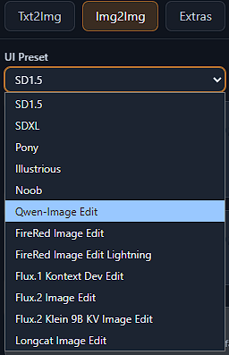
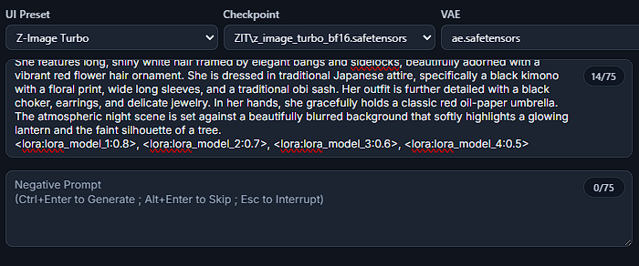

# ComfyUI-RookieUI
<br>

<div align="center">
  
</div>

<br>

ComfyUI-RookieUI is a ComfyUI custom node extension that reproduces an A1111-style sidebar workflow while keeping inference inside native ComfyUI execution. **The project target is not only visual similarity.** RookieUI aims to reproduce A1111-style workflow semantics for Stable Diffusion in a ComfyUI host:

- **prompt / negative prompt parsing and conditioning behavior**
- **sampler / scheduler / seed / CFG mapping**
- **img2img, inpaint, and extras postprocessing flows**
- **integrated ControlNet and ADetailer behavior**
- **PNG metadata embedding, round-trip, and apply workflow**
- **Prompt Workbench authoring tools and XYZ Plot sweep sessions**
- **queue / progress / result UX and host-integrated workflow behavior**

<br>

The core objective of this project is not merely to replicate the classic UI/UX, but to faithfully reproduce A1111's unique prompt parsing capabilities and image generation characteristics for the Stable Diffusion model family to the greatest extent possible. Even so, RookieUI supports more than just the Stable Diffusion family.

<details><summary><h2>Last updates - Click to expand</h2></summary>

<details>

<summary><strong>ComfyUI host refresh alignment (stability/compatibility)</strong></summary>

- Direct RookieUI queue submissions now carry the `comfyui-rookieui` ComfyUI API-node usage-source tag while preserving separate RookieUI origin metadata and A1111-style PNG `parameters` metadata.
- The official template manifest is aligned to `comfyui-workflow-templates` 0.10.3; shipped support remains limited to the RookieUI profiles listed below.
- `RookieUISaveImageWithMetadata` now mirrors the current host `SaveImage` pass-through `IMAGE` output socket while preserving raw A1111 `parameters` PNG metadata.
- Newly observed 0.10.3 blueprint additions, including SCAIL-2 character replacement, Depth Anything 3 image/video depth, Bernini-R image/video edit, TripoSplat, Anima Base 1.0, and Ideogram v4 workflows, are deferred or follow-up candidates until dedicated RookieUI UI/runtime scope exists.
- Existing deferred blueprint product surfaces, including Qwen inpaint/outpaint/layered, Z-Image upscale, BiRefNet background removal, SAM3, MoGe, Mediapipe, Lotus depth, video, audio, 3D, and Gemini captioning workflows, remain outside the shipped profile list.

</details>

<details>

<summary><strong>Generation metadata and preview action parity hotfix (stability/parity)</strong></summary>

- Generated outputs now embed raw A1111-style `parameters` PNG metadata while keeping RookieUI and ComfyUI workflow metadata separate through the normal host metadata path.
- Preview quick actions now prefer completed final output artifacts instead of stale live-preview frames, so output handoff uses the generated image and its available metadata.
- `Send to Img2Img` and `Send to Inpaint` transfer image plus generation fields such as prompt, negative prompt, steps, sampler, scheduler, CFG, seed, size, and model; `PNG Info` remains an inspect action and `Extras` remains an image handoff.

</details>

<details>

<summary><strong>Official template parity refresh for Qwen, Flux, and Z-Image (new functionality/stability)</strong></summary>

- Added Qwen-Image Edit 2511 as an official `img2img` image-edit profile, including the plus edit encoder path, multi-reference request handling, Flux reference-method latent setup, and official default model-hint behavior.
- Added official txt2img profile coverage for `Flux.1 Krea Dev` and `Flux.2 Dev`, including family-specific defaults, hidden official encoder bundles, Flux guidance where applicable, and source-backed model/text-encoder/VAE/LoRA selector hints.
- Rechecked existing Qwen, Z-Image, ERNIE, FireRed, Flux.2 edit/Klein, and Longcat official profile hints so visible selectors describe real host prerequisites instead of accepting broad fallback matches.

</details>

<details>

<summary><strong>Z-Image Turbo ControlNet model-patch workflow support (new functionality/stability)</strong></summary>

- Z-Image Turbo ControlNet now uses the official model-patch workflow path with `ModelPatchLoader` and `QwenImageDiffsynthControlnet` instead of the generic SD ControlNet loader/apply chain.
- RookieUI recognizes Z-Image ControlNet artifacts from the host `model_patches` inventory, classifies Union/Tile, Turbo/non-Turbo, lite, release-tag, and condition support metadata, and reports missing model-patch or node prerequisites explicitly.
- The shipped Z-Image Turbo path supports one enabled ControlNet unit at a time, with dedicated Canny, Depth, and Pose/control-image adapter behavior while keeping generic ControlNet behavior unchanged for SD-family workflows.

</details>

<details>

<summary><strong>Frontend maintainability and API contract hardening (stability/maintainability)</strong></summary>

- Added broader frontend architecture budgets, TypeScript contract checks, and regression tests to prevent high-churn sidebar/API files from silently regrowing.
- Extracted generation payload state conversion, Img2Img mode/reference helpers, generation API domain calls, ControlNet preview/preprocessor surfaces, design tokens, and ControlNet stylesheet ownership into focused frontend modules.
- Kept public sidebar behavior stable while improving typed API request/response seams and making future `txt2img`, `img2img`, ControlNet, and official-template changes easier to validate.

</details>

<details>

<summary><strong>Supply-chain validation hardening (security/stability)</strong></summary>

- Repository validation now uses lockfile-frozen frontend installs, reducing accidental dependency drift during local and CI checks.
- Added a repo-local supply-chain scan for known affected npm/PyPI package versions, suspicious persistence indicators, and unexpected npm install scripts.
- GitHub Actions dependency review and pinned workflow action references now cover dependency changes and token-bearing registry publication paths.

</details>

<details>

<summary><strong>Extras postprocessing runtime and ComfyUI host compatibility refresh (new functionality/stability)</strong></summary>

- `Extras` now has a RookieUI-managed postprocessing execution path for single-image and batch inputs, including scale-by/scale-to resizing, output asset generation, preview data, and preserved source metadata where available.
- Selected ComfyUI upscale models can be used for Extras upscaling when the active host exposes the matching model/runtime; a second upscaler can be blended by visibility, and unavailable upscalers fall back to PIL Lanczos with explicit warnings.
- `GFPGAN` and `CodeFormer` face-restoration requests now use a runtime-adapter contract with per-image diagnostics; when no compatible backend is available, RookieUI continues without face restoration and reports that status clearly.
- Frontend host integration now declares and uses the ComfyUI `fetchApi` runtime surface, handles sidebar tab unregister/re-register cleanup, and keeps the legacy launcher fallback for older host surfaces.
- Model inventory now recognizes current ComfyUI postprocessing-related folders such as latent upscalers and background-removal models as diagnostic catalog categories, while package metadata also declares RookieUI web assets through the current ComfyUI custom-node metadata path.

</details>

<details>

<summary><strong>Recent debug fixes and UI state hardening (stability)</strong></summary>

- PNG Info import now keeps A1111 txt2img Hires.fix metadata on the txt2img path, so SDXL-size A1111 images continue into the RookieUI A1111 SDXL prompt encoder workflow instead of falling back to native ComfyUI text encode nodes.
- Imported A1111 Hires.fix values now populate existing RookieUI hires controls where supported, while unsupported external upscaler labels fall back safely with a warning instead of producing an invalid request.
- RookieUI sidebar fields now survive host sidebar hide/show re-renders during the same browser session, including prompt text, selected menu values, checkbox/range fields, and the active top tab.
- Added regression coverage for these debug paths so PNG Info routing and sidebar state persistence stay pinned during future frontend/backend changes.

</details>

<details>

<summary><strong>Stable Diffusion single-node A1111 prompt encoder parity (new functionality/stability)</strong></summary>

- `RookieUI A1111 CLIP Text Encode` and `RookieUI A1111 CLIP Text Encode SDXL` now handle more A1111-style prompt conditioning behavior inside the encoder node itself instead of relying only on outer workflow graph composition.
- Added single-node handling for prompt schedules, alternates, `AND`, `BREAK`, branch strength metadata, timestep ranges, token rebatching, parser-mode selection, and SDXL global/local channel pairing.
- Added parser modes for `A1111`, `full`, `comfy++`, and `fixed attention`, with default behavior kept on the A1111-style path.
- Added old-emphasis compatibility, mean-normalized weighted conditioning, textual inversion alias/prefix handling, explicit missing-embedding diagnostics, and SDXL `clip_g` / `clip_l` embedding-channel handling.
- Added a report-only local tensor-summary comparison helper for same-model prompt-conditioning checks without requiring private assets in the repository.
- Kept a legacy encoder fallback option so existing host environments can restore the previous tokenization path if needed without changing required node inputs.

</details>

<details>

<summary><strong>Prompt Workbench frontend modularization and inline surface hardening (stability)</strong></summary>

- Split the enlarged Prompt Workbench frontend shell into focused modules for i18n, language selection, group tags, catalogs, token-board behavior, and secondary surfaces.
- Added regression coverage around extracted module boundaries so tab switching, cross-pane routing, and Prompt Workbench state stay stable after frontend changes.
- Tightened inline Prompt Workbench behavior for compact toolbar affordances, icon-first controls, hover settings, keyword input, and model-library dropdowns.

</details>

<details>

<summary><strong>Prompt Workbench localized group tags and language sync closure (new functionality/stability)</strong></summary>

- Added an inline Group Tags board with group/subgroup tabs, localized tag labels, show/hide behavior, and add/remove interaction on the prompt authoring surface.
- Expanded Prompt Workbench scoped UI localization beyond English and Traditional Chinese, with deterministic fallback handling for configured locale fallbacks such as Hong Kong Traditional Chinese falling back through `zh-TW`.
- Prompt and negative prompt workbench language controls now stay synchronized globally, including the inline chips, keyword placeholders, workbench titles, Assist language selector, local translation targets, and language-sensitive catalog resources.
- Tightened frontend asset cache busting and regression coverage for Prompt Workbench language switching so recent UI fixes are less likely to be masked by stale browser assets.

</details>

<details>

<summary><strong>Prompt Workbench language selector and host-safe overlay parity (new functionality/stability)</strong></summary>

- Added an inline language control in the `Prompt Workbench` header, so local-language selection is available directly from the prompt authoring surface instead of only from the assist panel.
- Expanded Prompt Workbench language options with host-aware locale aliases and deterministic fallback/normalization for A1111/ComfyUI-style codes such as `en_US`, `zh_TW`, and `zh_CN`.
- Language selection now synchronizes persisted config, inline labels, the Assist language selector, local translation targets, token local-language rows, and language-sensitive catalog/group-tag refresh.
- Hardened selector placement, dismissal, focus return, and keyboard behavior so the control remains usable inside ComfyUI/RookieUI sidebar containers.

</details>

<details>

<summary><strong>Hosted API integration hardening (stability)</strong></summary>

- Hardened hosted ComfyUI API integration for runtime API resolver submission paths.
- Improved model inventory recovery from ComfyUI `object_info`, reducing blank or degraded model lists when the host catalog is still available through the API.
- Tightened txt2img/img2img submission payload alignment so generated requests stay closer to the active host contract.

</details>

<details>

<summary><strong>ControlNet profile-aware preprocessing and pixel-perfect preview alignment (new functionality/stability)</strong></summary>

- ControlNet preprocessors now use a RookieUI-owned profile registry, so preprocessor variants carry truthful metadata for host annotator preference, control type, parameter labels, UI fields, and optional secondary outputs.
- `Pixel Perfect` now affects preprocessor preview/runtime resolution when target and source dimensions are known, instead of being stored as inert UI state.
- The integrated ControlNet editor now updates visible controls and labels based on the selected preprocessor profile, reducing misleading generic threshold fields for preprocessors that do not use them.
- Pose-capable preprocessors can preserve bounded OpenPose-format JSON metadata when the host backend returns it, while keeping this metadata optional and scoped to pose preprocessors only.

</details>

<details>

<summary><strong>XYZ Plot full A1111 input-parity alignment (new functionality/stability)</strong></summary>

- `XYZ Plot` input behavior now follows A1111 more closely across the shipped sweep surface instead of keeping RookieUI-local syntax for prompt, choice, and hires axes.
- `Prompt S/R` now uses A1111-style CSV search/replace input (`SOURCE, TARGET1, TARGET2, ...`), `Prompt order` follows A1111-style prompt-token reordering semantics, and missing `Prompt S/R` search terms now fail explicitly instead of silently no-oping.
- Choice-backed axes now support a global `Use text inputs instead of dropdowns` toggle, while sampler/scheduler labels, checkpoint fragment matching, and VAE `Automatic` / `None` input behavior now align with A1111-facing usage.
- `Hires steps` now accepts the A1111-style `0` sentinel to reuse the base step count, and the `Hires upscaler` axis now exposes truthful built-in upscaler choices instead of unrelated inventory upscaler names.

</details>

<details>

<summary><strong>Official image-edit workflow coverage (new functionality/stability)</strong></summary>

- RookieUI now treats official image-edit workflows as `img2img`-owned image-edit subtypes instead of routing them through a dedicated visible `Edit` mode or a legacy SD-style inpaint fallback.
- The visible official image-edit profile set includes `Qwen-Image Edit`, `Qwen-Image Edit 2511`, `FireRed Image Edit`, `FireRed Image Edit Lightning`, `Flux.1 Kontext Dev Edit`, `Flux.2 Image Edit`, `Flux.2 Klein 9B KV Image Edit`, and `Longcat Image Edit`.
- Image-edit flows now follow bounded official semantics directly in RookieUI: they do not require user masks, preserve ordered `reference_images` plus `main_reference_index`, and support bounded multi-reference input where the official template family requires it.

</details>

<details>

<summary><strong>Non-SD official template inline LoRA chaining (new functionality/stability)</strong></summary>

- RookieUI now supports prompt-inline `<lora:model_name:weight>` chaining on shipped official non-SD template workflows instead of limiting those families to hidden template defaults only.
- When an official non-SD preset already owns a template LoRA, RookieUI keeps the official default first and appends user prompt-inline LoRAs after it so the submitted ComfyUI graph matches the intended chained `Load LoRA` model path.
- The shipped non-SD inline LoRA path applies model-only LoRA nodes; when a prompt requests distinct clip/text-encoder strength, RookieUI now reports truthful drift messaging and uses the model-side strength only.

</details>

<details>

<summary><strong>Official non-SD template preset expansion, inline LoRA chaining, and truthful host gating (new functionality/stability)</strong></summary>

- Expanded RookieUI's non-SD preset matrix to official ComfyUI text-to-image template families, including `Anima`, `Chroma`, `ERNIE-Image`, `ERNIE-Image Turbo`, `Flux.1 Dev FP8`, `Flux.2 Klein` variants, `HiDream i1` variants, `Longcat BF16`, `Qwen-Image 2512`, `Z-Image`, and `Z-Image Turbo`.
- Recent official template refreshes also add `Flux.1 Krea Dev` and `Flux.2 Dev` as txt2img profiles, and `Qwen-Image Edit 2511` as an image-edit profile on the `img2img` surface.
- Aligned runtime translation to official non-SD topology and parameter semantics instead of generic fallback graphs, including family-specific `Shift`, `Flux Guidance`, `Prompt Enhancement`, and template-owned hidden encoder bundles where the official workflows require them.
- Shipped official non-SD template paths now also support prompt-inline `<lora:model_name:weight>` chaining, preserving any template-owned LoRA first and then appending user inline LoRAs through model-only `Load LoRA` nodes before host submission.
- Tightened catalog validation so official non-SD presets only pass when the active ComfyUI host exposes the required family-aligned models and template assets; missing host assets are now reported as external prerequisites instead of silently accepted fallback matches.

</details>

<details>

<summary><strong>Prompt Workbench Danbooru host-action integration (new functionality/stability)</strong></summary>

- Added a truthful `Upsample Tags` editor-toolbar action to `Prompt Workbench`, backed by a dedicated RookieUI `/rookieui/prompt-tools/upsample` route and host-node detection against the active ComfyUI registry.
- The new action applies returned prompt text back into the active `Prompt Workbench` draft and bound prompt input without changing existing translation, AI-assist, history/favorites, or formatting behavior.
- When the host-side Danbooru upsampler node is missing or unavailable, RookieUI now reports explicit disabled-state and route-level `host-unavailable` behavior instead of implying the action is always present.
</details>

<details>

<summary><strong>Stateful-surface durability and runtime freshness hardening (stability/tooling)</strong></summary>

- Hardened `Prompt Workbench` and `XYZ Plot` persisted state with atomic JSON writes and corrupt-state quarantine instead of silent reset-on-parse-failure behavior.
- Added `XYZ Plot` async session-state coordination and bounded stale-session pruning so long-running hosts keep queue-backed sweep state consistent without unbounded retained history.

</details>

<details>

<summary><strong>Prompt Workbench and XYZ Plot delivery (new functionality/stability)</strong></summary>

- Shipped an integrated `Prompt Workbench` in the `txt2img` and `img2img` prompt band, with persisted prompt/negative namespaces, quick-insert catalogs, translation tooling, AI assist delivery, history/favorites, and blacklist-aware formatting.
- Shipped a built-in `XYZ Plot` sweep surface for `txt2img` and `img2img`, including axis registry, estimate checks, queue-backed session runs, main-grid/sub-grid assembly, primary-preview synchronization, fullscreen result inspection, and metadata-aware result delivery.
- Added recent `XYZ Plot` parity follow-ups for choice-axis multiselect entry, running partial-grid preview delivery, A1111-style seed-policy controls (`Keep -1 for seeds` plus per-axis seed variation toggles), and output mirroring for assembled grids.

</details>

<details>

<summary><strong>Extensibility refactor and architecture hardening (stability/maintainability)</strong></summary>

- Extracted shared workflow graph builders into `rookieui/services/workflow_builders/*`, keeping `workflow_translation.py` as the stable orchestration façade instead of a regrowing graph monolith.
- Split `ControlNet` and `ADetailer` backend ownership into focused catalog, normalization, runtime/refinement, and warning modules behind stable route-facing façades.
- Added backend/frontend integrated feature registries so sidebar bootstrap ownership no longer depends on ad-hoc one-off wiring.
- Added manifest-backed architecture guardrails, import-cycle checks, and façade size budgets to keep the refactor honest as these high-churn surfaces continue to expand.
- Added frontend architecture budgets, typed API contracts, generation payload state seams, Img2Img helper modules, ControlNet preview/preprocessor modules, design tokens, and ControlNet-owned CSS so future sidebar changes stay bounded.

**Architecture**

```text
ComfyUI process (single runtime)
|
+- ComfyUI core
|  +- native routes (/prompt, /history, /view, /ws, ...)
|  +- execution engine and model runtime
|
+- ComfyUI-RookieUI custom node package
   +- frontend sidebar shell + bootstrap registry
   |  +- web/rookieui_extension.js
   |  +- web/rookieui_feature_registry.js
   |  +- web/rookieui_sidebar_shell.js
   |
   +- internal routes under /rookieui/*
   +- stable backend facades
   |  +- workflow_translation.py
   |  +- controlnet.py
   |  +- adetailer.py
   |
   +- extracted backend ownership seams
   |  +- workflow_builders/*
   |  +- controlnet_* modules
   |  +- adetailer_* modules
   |  +- integrated_feature_registry.py
   |
   +- extracted frontend ownership seams
      +- web/api/*
      +- web/types/*
      +- web/sidebar_tabs/img2img/*
      +- web/sidebar_tabs/controlnet/*
      +- web/rookieui_tokens.css
      +- web/rookieui_controlnet.css
   |
   +- workflow submission into host ComfyUI queue
```

Current extension seams:

- `workflow_translation.py` is now a stable orchestration facade that delegates graph-building work into `rookieui/services/workflow_builders/*`.
- `controlnet.py` and `adetailer.py` stay as route-facing facades while catalog, normalization, runtime/refinement, and warning ownership live in focused vertical modules.
- `web/rookieui_extension.js` and `web/rookieui_feature_registry.js` now own integrated bootstrap loading explicitly, instead of scattering one-off feature fetch wiring through the extension entrypoint.
- `web/rookieui_api.js` remains a compatibility facade while generated requests move through focused API transport/domain modules and typed frontend contracts.
- `txt2img` / `img2img` generation payloads, Img2Img reference and mode behavior, and ControlNet preview/preprocessor UI are now guarded by dedicated module-level tests.
- The refactor is guarded by manifest-backed boundary checks, facade/file-size budgets, type checks, CSS ownership checks, and import-cycle regression coverage.

</details>

<details>

<summary><strong>SD-family prompt parity maximal continuation and host validation (new functionality/stability)</strong></summary>

- Added inventory-aware embeddings / textual inversion handling on the shipped SD-family prompt path, with canonical host-compatible `embedding:<name>` tokens and explicit missing-reference diagnostics.
- Added A1111-style alternate prompt scheduling for forms such as `[a|b]`, while keeping `BREAK`, `AND`, scheduling slices, and attention markers on RookieUI-owned SD-family encoder seams.
- Hardened SD-family token chunk behavior with recent comma backtrack and grouped textual-inversion boundary preservation when the active host tokenizer exposes word-id metadata, with safe fallback on hosts that do not.
- Added shared golden fixtures and reference-backed token differential coverage for the shipped SD-family parity surface.

</details>

<details>

<summary><strong>Native ADetailer and advanced ControlNet runtime upgrade (new functionality)</strong></summary>

- Upgraded ADetailer to a RookieUI-owned detector/runtime path with packaged Ultralytics/OpenCV-backed dependency support instead of relying on an external A1111 script or third-party node pack.
- Added native advanced ControlNet execution support for stage-aware weights, timestep scheduling, and mask-aware application in the shared RookieUI workflow translator.
- Kept main-generation ControlNet and ADetailer-local ControlNet on the same native apply seam so advanced behavior stays consistent across base and refinement stages.
- Improved runtime availability metadata so the UI can report the real detector/advanced-ControlNet capability surface instead of implying unsupported host features.

</details>

<details>

<summary><strong>Preview fullscreen viewer and frontend regression hardening (new functionality/stability)</strong></summary>

- Added a preview-only fullscreen viewer for generated images in `txt2img` and `img2img`, with direct surface activation and zoom-only inspection.
- Improved preview discoverability with visible overlay controls and consistent fullscreen enter/exit feedback.
- Hardened frontend regression coverage so fullscreen behavior is validated through real user actions instead of DOM-existence checks only.
- Added a shipped-frontend asset revision fingerprint guard to reduce stale-browser-cache regressions after UI hotfixes.

</details>

<details>

<summary><strong>ADetailer integrated parity rollout (new functionality)</strong></summary>

- Added an integrated ADetailer editor in `txt2img` and `img2img` with four unit tabs, grouped controls, and A1111-style layout on top of RookieUI's native sidebar shell.
- Added host-native detect-mask-refine workflow translation so enabled ADetailer units run as a secondary refinement stage without embedding A1111 ScriptRunner runtime.
- Added ControlNet `none` / `passthrough` / `custom` behavior inside the ADetailer refinement context, keeping base-generation ControlNet state isolated from detailer-local execution.
- Added detector/model availability guidance, warning codes, and diagnostics so degraded ADetailer behavior is reported explicitly instead of silently disappearing.
- Added route-level regression coverage and rollback/no-op validation for the full ADetailer runtime chain.

</details>

<details>

<summary><strong>Stable Diffusion prompt parity rollout (new functionality)</strong></summary>

- Added RookieUI-owned A1111-style prompt compilation for the Stable Diffusion family, including support for `BREAK`, `AND`, scheduling slices, and attention markers.
- Added SD-family parity text-encode routing so prompt semantics compile into deterministic ComfyUI conditioning graphs instead of relying on raw prompt passthrough.
- Kept newer/non-SD families on their native ComfyUI text-encode/runtime paths, aligning the product scope to A1111 reproduction where it is actually meaningful.
- Added capability and API truthfulness updates so the UI reports the real prompt-semantics support surface instead of implying unsupported parity on unrelated model families.

</details>

<details>

<summary><strong>ControlNet preprocessor execution and diagnostics hardening (bugfix/stability)</strong></summary>

- Added control-type-aware preprocessor option narrowing, so each type shows only relevant annotator choices.
- Expanded preprocessor catalog to include variant-level options (for example depth/lineart/openpose families) in integrated ControlNet units.
- Updated backend detect/runtime dispatch to respect selected preprocessor variants, prefer matching host annotator nodes, and keep OpenPose-family execution isolated to the requested variant instead of cross-family fallback synthesis.
- Improved run-preprocessor status messaging to report both the selected preprocessor option and the actual backend processor used, with explicit warning diagnostics when the host output is degraded or unavailable.
- Expanded backend/frontend regression coverage for variant filtering and variant-aware dispatch behavior.

</details>

<details>

<summary><strong>ControlNet A1111-native parity (new functionality)</strong></summary>

- Added A1111-style multi-unit ControlNet editing surface in generation panes (`txt2img` and `img2img`).
- Added host-native ControlNet graph integration for `txt2img`, `img2img`, and `inpaint`, with deterministic multi-unit apply order.
- Added dual payload compatibility for RookieUI-native units and A1111-style `alwayson_scripts.controlnet` input.
- Added canonical `/rookieui/controlnet/*` routes and A1111-compatible `/controlnet/*` alias routes.
- Added optional preprocessor/detect downgrade behavior with explicit warning diagnostics when optional dependencies are unavailable.

</details>

<details>

<summary><strong>Runtime contract and UX consistency fixes (bugfix/stability)</strong></summary>

- Updated shell version display to use backend capability payload sourced from `pyproject.toml`, removing hardcoded frontend version coupling.
- Fixed `RookieUILoadAssetMask` validation signature mismatch that could raise missing-argument errors during img2img inpaint validation.
- Fixed mask-canvas slider consistency issue where `Opacity` / `Zoom` initial displayed values and slider positions could diverge.
- Expanded targeted regression coverage for the above runtime and UI-state contract paths.

</details>

<details>

<summary><strong>Prompt semantics parity (new functionality)</strong></summary>

- Added structured prompt-semantic parsing for `AND`, `BREAK`, scheduling slices, and attention markers.
- Added conditioning-plan compilation so parsed prompt semantics map into ComfyUI conditioning graph composition for txt2img and img2img flows.
- Preserved deterministic inline LoRA extraction/merge behavior while expanding prompt semantics support.

</details>

<details>

<summary><strong>Parity guardrails and rollout safety (stability)</strong></summary>

- Added stable warning-code diagnostics for prompt parsing/compilation paths.
- Added a bounded legacy fallback switch so prompt-semantics rollout can be reverted safely in runtime variance scenarios.
- Expanded regression checks around parser/compiler integration and fallback behavior.

</details>

<details>

<summary><strong>Img2Img source/mask handoff hardening (bugfix)</strong></summary>

- Fixed a mask-canvas placeholder false-positive where `No source image` could appear after a valid txt2img `Send to Img2Img` handoff.
- Hardened source-binding visibility contract for mask-canvas preview so source image state and placeholder state remain consistent.
- Added regression coverage for source-image/mask bridge behavior in send-to-img2img flow.

</details>

<details>

<summary><strong>Img2Img workflow expansion and interaction polish</strong></summary>

- Added an embedded Img2Img in-app mask canvas with core controls: brush/eraser, size/opacity, undo/redo, clear/invert, zoom/pan/fit, and explicit `Apply Mask`.
- Added advanced mask editing operations for inpaint usability: rectangle selection, selection fill/erase/invert, and bounded selection move controls.
- Introduced a dedicated Img2Img mode router contract so visible mode switching and backend mode payload stay synchronized through one deterministic path.
- Upgraded Img2Img mode UX to A1111-style second-level generation subtabs (`img2img`, `Sketch`, `Inpaint`, `Inpaint sketch`, `Inpaint upload`, `Batch`) while preserving existing backend compatibility.
- Hardened high-risk UI paths around mode switching, mask editing, and backend payload synchronization.

</details>
</details>

## Table of Contents

- [Last updates](#last-updates---click-to-expand)
  - [Generation metadata and preview action parity hotfix](#generation-metadata-and-preview-action-parity-hotfix)
- [Installation](#installation)
- [Feature Overview](#feature-overview)
  - [Official Non-SD Template Presets](#official-non-sd-template-presets)
  - [Image-Edit Workflows](#image-edit-workflows)
  - [Current Official Image-Edit Coverage and Template-Owned LoRAs](#current-official-image-edit-coverage-and-template-owned-loras)
  - [Official Non-SD Inline LoRA Support](#official-non-sd-inline-lora-support)
- [Extensions](#extensions)
  - [Prompt Workbench](#prompt-workbench)
    - [Prompt Workbench Danbooru Upsampler Action](#prompt-workbench-danbooru-upsampler-action)
  - [XYZ Plot](#xyz-plot)
  - [ControlNet Support](#controlnet-support)
  - [ADetailer Support](#adetailer-support)
  - [Support for Other Extensions](#support-for-other-extensions)
- [Runtime and Host Integration](#runtime-and-host-integration)
  - [ComfyUI Host Compatibility](#comfyui-host-compatibility)
  - [Stable Diffusion Prompt Parity](#stable-diffusion-prompt-parity)
  - [Default Model Read Paths](#default-model-read-paths-host-comfyui)
- [License](#license)


## Installation

1. Install via ComfyUI-Manager (recommended)
   Search for `ComfyUI-RookieUI` in Manager and install it. If the package does not appear, update ComfyUI-Manager and refresh its custom-node list.
   RookieUI includes a root `requirements.txt` so Manager-style installs can resolve the extension's extra Python dependencies in the host environment.

2. Install as a ComfyUI custom node (manual)

```bash
git clone https://github.com/rookiestar28/ComfyUI-RookieUI custom_nodes/ComfyUI-RookieUI
cd custom_nodes/ComfyUI-RookieUI
python -m pip install -r requirements.txt
```

Then restart ComfyUI. The `RookieUI` sidebar tab will be available in the frontend host.

`ControlNet` and `ADetailer` support are built into RookieUI itself. You do not need to install separate external custom-node packs just to use RookieUI's integrated ControlNet or ADetailer surfaces.

Required extra Python packages for RookieUI:

- `opencv-python-headless>=4.10.0`
- `ultralytics>=8.3.0`

If your host or Manager install path does not automatically install custom-node dependencies, run `python -m pip install -r requirements.txt` manually in the same Python environment used by ComfyUI. These packages power RookieUI's native ADetailer detector/runtime path and related image-processing helpers.

## Feature Overview

### Sidebar UI

<div align="left">
  
</div>
<br>

- A1111-like compact tab rail and control panel layout
- Hero `Generate` rail with compact action icons
- Family-aware preset behavior with SD-family parity lanes plus official non-SD template-backed preset/profile lanes
- Progress text and queue/history integration in sidebar flow
- Live preview panel with runtime updates and flicker-mitigated rendering
- Fullscreen preview viewer for generated results, with direct surface activation and zoom-only inspection
- Preview quick actions for output handoff to `Img2Img`, `Inpaint`, `Extras`, and `PNG Info`, using completed output artifacts and metadata when available
- Host-aware sidebar registration with stale-tab cleanup on current ComfyUI frontends and a legacy launcher fallback for older hosts

### Generation

- `txt2img` request normalization and workflow translation
- `img2img` request normalization with guarded asset-handle path
- `img2img` mode surface: `img2img`, `sketch`, `inpaint`, `inpaint_sketch`, `inpaint_upload`, `batch`
- Hires second-pass controls for generation flows (`txt2img` and `img2img`)
- Stable Diffusion family prompt semantics parity through RookieUI-owned encoder nodes, including parser modes, `BREAK`, `AND`, scheduling slices, alternate scheduling, attention markers, old-emphasis compatibility, weighted conditioning, and embeddings / textual inversion tokens
- Official non-SD template translation for shipped txt2img presets, including family-specific parameter mapping such as `shift`, `flux_guidance`, and `prompt_enhancement_enabled` where the official workflow requires them
- Official txt2img profiles include newer Flux lanes such as `Flux.1 Krea Dev` and `Flux.2 Dev`, with official encoder/model/LoRA prerequisites surfaced through the normal model selector contract
- Z-Image Turbo can use official model-patch ControlNet workflows through host `model_patches` inventory when the required ComfyUI nodes and patch files are available
- ComfyUI-native prompt submission with host API-node usage-source attribution, embedded A1111-style `parameters` metadata, and separate RookieUI origin metadata

### Image-Edit Workflows

<br>
<div align="left">
  
</div>
<br>

- official image-edit workflows live on the `img2img` surface as dedicated image-edit profiles instead of a separate visible `Edit` mode
- visible image-edit profiles: `Qwen-Image Edit`, `Qwen-Image Edit 2511`, `FireRed Image Edit`, `FireRed Image Edit Lightning`, `Flux.1 Kontext Dev Edit`, `Flux.2 Image Edit`, `Flux.2 Klein 9B KV Image Edit`, and `Longcat Image Edit`
- image-edit request normalization preserves ordered `reference_images` and `main_reference_index` so official single-reference and bounded multi-reference workflows can share one truthful payload surface
- image-edit flows do not require user masks; mask-oriented SD inpaint controls stay on the normal `img2img` inpaint paths instead of leaking into official edit workflows
- family-specific edit builders now cover template-owned LoRA chaining, Qwen/Qwen+ edit encoders, Flux/Klein multi-reference latent setup, and Longcat edit guidance on dedicated non-SD runtime paths

### Prompt Workbench

- integrated prompt-band workbench in `txt2img` and `img2img`
- persisted `prompt` / `negative` namespace state, history, and favorites
- inline language selector shared across prompt/negative scopes, with host-aware locale alias normalization, configured fallback-code handling, localized UI copy, and synchronized local translation/catalog state
- quick-insert catalogs for group tags, prompt-library entries, embeddings, and LoRA references
- localized Group Tags board with group/subgroup tabs, local/en labels, show/hide controls, and add/remove behavior
- translation, prompt analysis, AI assist delivery, and blacklist-aware formatting tools
- truthful Danbooru host-action support for `Upsample Tags` when the host-side upsampler node is installed and available
- provider truthfulness for shipped, reference-only, unavailable, and misconfigured Prompt Workbench provider states

### XYZ Plot

- integrated bottom-mounted sweep surface in `txt2img` and `img2img`
- axis registry with estimate checks before queue submission and multiselect choice-axis entry where appropriate
- queue-backed session runs with progress, cancellation, seed-policy controls, and result tracking
- running sessions can surface partial main-grid preview while completed results sync into the shared preview box and the normal host output flow
- delivered results include main grid, sub-grids, lone cell images, fullscreen inspection support, and XYZ metadata

### PNG Info

- image-first metadata ingest from file upload, drag/drop, and preview quick actions
- generated RookieUI PNG outputs embed A1111-style `parameters` metadata for later inspection and reuse
- A1111 metadata parsing path, including RookieUI-generated infotext
- automatic positive/negative prompt extraction
- apply parsed parameters into `txt2img` or `img2img`
- ComfyUI workflow metadata remains inspect-only, while A1111 inpaint metadata surfaces explicit `missing_inputs` diagnostics until the required mask/source assets are selected manually

### Extras

- single-image/batch postprocessing surface with RookieUI-managed output assets and preview payloads
- preview quick action handoff from completed generation outputs
- scale-by and scale-to resizing through a dedicated extras contract and execution path
- selected ComfyUI upscaler model execution when available, plus PIL Lanczos fallback with explicit warnings when the host runtime or model is unavailable
- optional second-upscaler blending through `upscaler_2_visibility`
- optional color-correction postprocessing through autocontrast
- `GFPGAN` and `CodeFormer` face-restoration request handling through a runtime-adapter seam, with guarded warnings and diagnostics when no compatible backend is available

### ADetailer

- integrated multi-unit ADetailer surface in `txt2img` and `img2img`
- four-unit editor with grouped controls and override gating
- host-native detect-mask-refine runtime chain
- RookieUI-native detector/runtime path backed by packaged Python dependencies instead of an external ADetailer node pack
- ControlNet `none` / `passthrough` / `custom` support inside detailer refinement
- explicit diagnostics and availability guidance for degraded detector/model states

### Model Controls

- SD1.5, SDXL, Pony, Illustrious, and Noob use RookieUI's Stable Diffusion parity text-encode path for A1111-style prompt semantics, single-node conditioning composition, parser-mode selection, old-emphasis compatibility, and inventory-aware embeddings / textual inversion handling
- Official non-SD template presets now surface family-specific controls only when the upstream workflow exposes them, including `Shift`, `Flux Guidance`, and `Prompt Enhancement`
- Fixed template-owned encoder bundles keep `Text Encoder` controls hidden on the shipped official non-SD preset matrix instead of implying a user-selectable pairing that the official template does not expose
- Model inventory includes current ComfyUI postprocessing-related catalog categories such as upscale models, latent upscalers, and background-removal models; some categories are diagnostic-only until a shipped RookieUI surface uses them directly
- Clip Skip remains editable in UI; some profiles may ignore it at execution time

### Official Non-SD Template Presets

- RookieUI ships official ComfyUI template-backed txt2img presets for `Anima`, `Chroma`, `ERNIE-Image`, `ERNIE-Image Turbo`, `Flux.1 Dev FP8`, `Flux.1 Krea Dev`, `Flux.2 Dev`, `Flux.2 4B Distilled Klein`, `Flux.2 4B Klein`, `Flux.2 9B Distilled Klein`, `Flux.2 9B Klein`, `HiDream i1 Dev FP8`, `HiDream i1 fast`, `HiDream i1 full`, `Longcat BF16`, `Qwen-Image 2512`, `Z-Image`, and `Z-Image Turbo`.
- Current official-template alignment uses `comfyui-workflow-templates` 0.10.3 as the source basis for refreshed host blueprints, but blueprint families outside the shipped profile list are not implied support.
- These presets follow official template defaults for width, height, steps, CFG, sampler, and scheduler, and they keep template-owned encoder bundles hidden when the official workflow hard-codes those pairings.
- Family-specific controls are preserved where the official workflows require them:
  - `Shift`: `Chroma`, `HiDream i1 Dev FP8`, `HiDream i1 fast`, `HiDream i1 full`, `Qwen-Image 2512`, `Z-Image`, `Z-Image Turbo`
  - `Flux Guidance`: `Flux.2 Dev`, `Longcat BF16`
  - `Prompt Enhancement`: `ERNIE-Image`, `ERNIE-Image Turbo`
- Official image-edit workflows ship as `img2img` image-edit profiles on the shared `Img2Img` preset surface rather than a separate visible `Edit` UI.
- SCAIL-2 character replacement, Depth Anything 3 image/video depth, Bernini-R image/video edit, TripoSplat, Anima Base 1.0, Ideogram v4, Qwen inpainting/outpainting/layered, Z-Image upscale, BiRefNet background-removal, SAM3 segmentation, MoGe/Lotus depth or geometry, Mediapipe detection, video/audio, 3D, and Gemini captioning blueprints are treated as deferred or follow-up product-surface candidates, not current RookieUI runtime surfaces.

### Current Official Image-Edit Coverage and Template-Owned LoRAs

- RookieUI's visible official ComfyUI `imageEdit` coverage includes `Qwen-Image Edit`, `Qwen-Image Edit 2511`, `FireRed Image Edit`, `FireRed Image Edit Lightning`, `Flux.1 Kontext Dev Edit`, `Flux.2 Image Edit`, `Flux.2 Klein 9B KV Image Edit`, and `Longcat Image Edit`.
- Official edit workflows are treated as image-edit flows, not as mask-first inpaint surfaces. The shipped image-edit path does not require mask input.
- Multi-reference image-edit families use canonical ordered `reference_images` plus `main_reference_index` payloads on the shared `img2img` request surface, with bounded support for official multi-reference templates such as `Qwen-Image Edit 2511`, `FireRed Image Edit`, `Flux.1 Kontext Dev Edit`, and `Flux.2 Klein 9B KV Image Edit`.
- Generic `img2img` hides official non-SD presets that are not aligned to an official image-input runtime, so users cannot accidentally route them into the legacy SD-style i2i graph and assume template parity that does not exist.
- Official templates that preload a fixed LoRA are treated as template-owned dependencies rather than silent hidden assets:
  - RookieUI shows the official default explicitly
  - allows manual override
  - and warns when a custom override no longer matches the official ComfyUI template exactly
- Template-owned LoRA controls are exposed for visible profiles:
  - `Flux.1 Dev FP8`
  - `Flux.2 Dev`
  - `Qwen-Image 2512`
  - `Qwen-Image Edit`
  - `FireRed Image Edit Lightning`
- A visible official image-edit profile may still remain unavailable on a given environment until the exact upstream model, text encoder, VAE, and template-owned LoRA labels required by the official template are installed on that host.

---

### Official Non-SD Inline LoRA Support

<div align="left">
  
</div>

<br>

- Shipped official non-SD template workflows now accept prompt-inline LoRA syntax such as `<lora:model_name:1>` on their native template runtime path instead of treating inline LoRAs as Stable Diffusion-only behavior.
- RookieUI extracts inline LoRA activations from the prompt, creates model-only `Load LoRA` nodes, and chains them immediately after the official `Load Diffusion Model` path before submitting the final ComfyUI workflow JSON to the host.
- When a preset already owns an official template LoRA, RookieUI preserves the official default first and appends prompt-inline LoRAs after it. This means the effective order is:
  - `Load Diffusion Model`
  - template-owned `Load LoRA` nodes
  - prompt-inline `Load LoRA` nodes
- This support applies to shipped official non-SD template txt2img and image-edit builders.

Simple usage:

1. Select a shipped official non-SD preset.
2. Type prompt-inline LoRA syntax directly in the prompt, for example `<lora:example_model:1>`.
3. Generate normally; RookieUI will append the corresponding model-only `Load LoRA` nodes automatically before the host run.

Behavior and limits:

- On non-SD official templates, inline LoRAs are treated as model-only LoRAs.
- If the prompt requests different model-side and clip/text-encoder-side strengths, RookieUI warns about parity drift and applies the model-side strength only.
- Template-owned official defaults remain the source of truth for official-template parity. Adding extra inline LoRAs is treated as extending the official template, not as strict unchanged parity.

### Model Support

- Stable Diffusion family
- Official non-SD template preset families: `Anima`, `Chroma`, `ERNIE-Image`, `Flux.1`, `Flux.2`, `HiDream i1`, `Longcat Image`, `Qwen-Image`, and `Z-Image`
- `Z-Image` also covers the Lumina/Z-Image naming lineage used by the official host templates and RookieUI aliases

Prompt semantics note:

- Exact A1111-style prompt parsing and conditioning parity is targeted at the Stable Diffusion family.
- Newer/non-SD families continue to use their native ComfyUI execution semantics even when exposed in the same RookieUI interface.

## Extensions

### Prompt Workbench

<div align="left">
  
</div>

<br>

Simple usage:

1. Open `txt2img` or `img2img`, then click `Open Workbench` in the prompt band.
2. Use the inline language control in either prompt scope to choose the local language for the Prompt Workbench UI, translation, assist, and catalog labeling; the prompt and negative workbench controls plus the Assist panel language selector stay synchronized with the same setting.
3. Switch between the `Prompt` and `Negative` scopes depending on which field you want to edit, then use `Capture Current Text` if you want to pull the current field value into the workbench explicitly.
4. Use the `Editor`, `History`, `Favorites`, `Catalog`, `Assist`, and `Format` panels as needed; token insertion, formatting cleanup, blacklist application, translation, and AI assist all operate on the active scope.
5. Choose a configured shipped translation or AI-assist provider before running translation/assist actions, then apply the returned text back into the active RookieUI prompt field.
6. Use the inline Group Tags board to browse localized group/subgroup tabs and add or remove tags from the active prompt text.
7. Use `Upsample Tags` when you want the active prompt expanded through the host-installed Danbooru upsampler node; the returned text writes back into the current Prompt Workbench draft and prompt field.
8. Insert, rewrite, or clean prompt text; the active scope writes back to the current RookieUI prompt field and persists across refreshes.

Behavior and compatibility:

- `Prompt Workbench` is built directly into RookieUI's prompt band instead of relying on an A1111 textarea hijack or a separate external extension surface.
- State is persisted separately for the shipped `txt2img` / `img2img` prompt and negative namespaces.
- Inline language selection is shared by the prompt and negative workbench scopes and persists through the Prompt Workbench config.
- The language catalog accepts common A1111/ComfyUI locale aliases such as `en_US`, `zh_TW`, and `zh_CN`, then normalizes them to RookieUI display codes and applies configured fallback behavior where a selected language uses another local UI pack.
- Changing language refreshes Prompt Workbench UI copy, inline chips, keyword placeholders, Assist language state, language-sensitive catalog/group-tag resources, local translation controls, and token local-language rows.
- The language selector uses viewport-safe overlay placement with Escape/outside-click dismissal and focus return for ComfyUI-hosted layouts.
- Catalog surfaces expose group tags, prompt-library entries, embeddings, and LoRA quick-insert helpers on the same workbench seam.
- Group Tags can be shown or hidden inline and support group/subgroup browsing plus add/remove behavior against the active prompt text.
- Translation and AI-assist delivery run through the built-in `/rookieui/prompt-tools/*` route family, with explicit truthfulness when a provider is shipped but unconfigured, reference-only, or otherwise unavailable on the current host/setup.
- Shipped translation execution paths are OpenAI-compatible chat translation and MyMemory public translation; AI assist uses the OpenAI-compatible provider contract.

#### Prompt Workbench Danbooru Upsampler Action

Simple usage:

1. Install the host-side `ComfyUI-Danbooru-Tags-Upsampler` node in the same ComfyUI environment as RookieUI, then restart ComfyUI so the node is visible in the active host registry.
2. Open `txt2img` or `img2img`, click `Open Workbench`, and stay on the primary `Prompt` scope.
3. Prepare the current prompt text, then click `Upsample Tags`.
4. RookieUI sends the current prompt through the host Danbooru upsampler route and applies the returned text back into the active workbench draft and bound prompt field.

Behavior and compatibility:

- `Upsample Tags` is a host action, not a translation provider or AI-assist provider.
- The action is limited to the primary `Prompt` scope; it is intentionally disabled on the `Negative` scope.
- RookieUI only enables the action when the active ComfyUI host exposes a compatible Danbooru upsampler node alias.
- If the host node is missing or unavailable, the toolbar remains truthful through disabled-state messaging and the backend route returns explicit `host-unavailable` status instead of pretending the feature exists.

---

### XYZ Plot

<div align="center">
  
</div>

<br>

Simple usage:

1. Open `txt2img` or `img2img`, scroll below `Hires.fix`, `ADetailer`, and `ControlNet`, then expand `XYZ Plot`.
2. Start from the current form as the base request, choose the `X`, `Y`, and optional `Z` axis types, then enter the values to sweep. Choice-backed axes use the built-in multiselect dropdown by default, and you can switch to raw A1111-style CSV entry with `Use text inputs instead of dropdowns`.
3. Review the seed controls when your sweep depends on deterministic or coordinate-varying seeds. RookieUI now supports `Keep -1 for seeds` plus separate `Vary seeds for X/Y/Z` toggles.
4. Run an estimate first to review generated image count, session warnings, and whether the current axis combination can execute.
5. Start the session and watch the session panel for progress. Running sessions can surface partial main-grid preview before the final assembled result is ready.
6. Inspect the generated main grid, sub-grids, or lone cell images when the run completes; assembled grids also mirror into the shared preview lane and normal host output flow.

Behavior and compatibility:

- `XYZ Plot` is integrated into RookieUI instead of being exposed as an A1111 script runner, but it stays as a dedicated bottom-mounted sweep surface in the generation panes.
- The surface is intentionally mounted below the `ADetailer` and `ControlNet` blocks and now follows the same collapsed-by-default section behavior as the surrounding extension panels.
- Runs are queue-backed sessions rather than a single monolithic prompt submission, so RookieUI can track per-session progress, cancellation, seed materialization, and grid assembly explicitly.
- Choice-backed axes use a RookieUI-owned multiselect dropdown with fill/clear behavior by default, but the shipped surface also supports a global A1111-style text-input mode for raw CSV entry.
- `Prompt S/R` now uses A1111-style CSV input, `Prompt order` follows A1111-style prompt-token reordering semantics, and sampler/scheduler/checkpoint/VAE/hires axes now accept A1111-facing labels or selector forms where applicable.
- `Hires steps` accepts `0` to reuse the same step count as the base image pass, matching A1111's visible input behavior, and the `Hires upscaler` axis now exposes truthful built-in upscaler choices instead of unrelated inventory upscaler names.
- The shipped seed-policy surface includes `Keep -1 for seeds`, per-axis `Vary seeds for X/Y/Z` toggles, and truthful fixed-seed/session metadata.
- Delivered results include a main grid, optional sub-grids, lone cell images, attached XYZ metadata for later inspection/reuse, and fullscreen zoom inspection through the shared preview viewer.

---

### ControlNet Support

<div align="left">
  
</div>
<br>

Simple usage:

1. Open `txt2img` or `img2img`, then enable a `ControlNet Unit`.
2. Upload a source image for that unit.
3. Choose a `Control Type`; the `Preprocessor` dropdown is automatically filtered to matching options.
4. Select a `Preprocessor` and (optionally) a `Model`, then click `Run Preprocessor` to update the preview lane.
5. Keep `Allow Preview` enabled if you want to display preprocessor output side-by-side.
6. Run generation. The ControlNet model is applied at generation stage, while preprocessor preview comes from the selected annotator/preprocessor.

Behavior and compatibility:

- A1111-style multi-unit ControlNet editor is available in `txt2img` and `img2img`.
- Backend execution uses native ComfyUI ControlNet nodes with deterministic multi-unit apply order.
- RookieUI ships its own integrated ControlNet request/runtime layer, so the feature does not depend on installing a separate external ControlNet UI extension.
- Selected preprocessor variants are driven by RookieUI's preprocessor profile registry, which supplies truthful control-type grouping, preferred host annotator nodes, parameter labels, UI field visibility, and optional secondary output capabilities.
- `Pixel Perfect` is wired into preprocessor preview/runtime resolution when source and target dimensions are available, matching ControlNet-style aspect-ratio behavior for crop/resize and resize/fill modes.
- Selected preprocessor variants are dispatched to matching host annotator nodes when available, including exact OpenPose-family variant routing.
- Pose-capable preprocessors can return bounded OpenPose-format JSON metadata through the detect payload when the active host annotator exposes it; non-pose preprocessors do not claim this output.
- Advanced native ControlNet behavior is available through RookieUI's shared runtime seam, including staged weighting, timestep scheduling, and mask-aware application where supported by the selected route.
- Z-Image Turbo ControlNet is a family-specific workflow path: matching Z-Image ControlNet files are read from host `model_patches`, loaded through `ModelPatchLoader`, and applied with `QwenImageDiffsynthControlnet` rather than the generic `ControlNetLoader` / `DiffControlNetLoader` path.
- The Z-Image Turbo path currently supports one enabled unit at a time, with Canny, Depth, and Pose/control-image adapter behavior. Unsupported modules fail explicitly instead of silently falling back to the SD ControlNet graph.
- Request compatibility supports both RookieUI native units and A1111-style `alwayson_scripts.controlnet` payloads.
- API surface provides both canonical RookieUI routes and A1111-compatible aliases:
  - `/rookieui/controlnet/*`
  - `/controlnet/*`
- Generic SD-family ControlNet still requires host-side ControlNet model files. Z-Image Turbo ControlNet requires matching host-side model-patch files and the required ComfyUI model-patch nodes. When a requested host preprocessor/runtime capability is unavailable, RookieUI returns explicit warning diagnostics and fallback status.

---

### ADetailer Support

<div align="left">
  
</div>
<br>

Simple usage:

1. Open `txt2img` or `img2img`, then enable `ADetailer`.
2. Pick an enabled ADetailer unit and select a detector.
3. Adjust prompt, negative prompt, mask, inpaint, and refinement overrides as needed.
4. Optionally choose ADetailer-local ControlNet mode: `none`, `passthrough`, or `custom`.
5. Run generation. Enabled ADetailer units refine the base result in a host-native secondary pass.

Behavior and compatibility:

- The ADetailer surface is integrated directly into RookieUI's generation panes instead of relying on an external A1111 script runner.
- Runtime behavior follows a detect-mask-refine pipeline built from native ComfyUI/RookieUI workflow nodes.
- Detector/runtime support is packaged with RookieUI's own dependency/runtime layer; no separate external ADetailer custom-node pack is required.
- Up to four ADetailer units are supported in the integrated editor.
- ControlNet coupling supports `none`, `passthrough`, and `custom` modes inside the refinement context.
- Native detector runtime uses RookieUI's packaged Python dependencies together with host model inventory, so matching detector/model files must still exist in the host environment.
- Availability guidance and warning diagnostics are exposed when detector/model/runtime dependencies are degraded.

### Support for Other Extensions

- Extension-style surfaces currently shipped in RookieUI are `ControlNet`, `ADetailer`, `Prompt Workbench`, and `XYZ Plot`.

---

## Runtime and Host Integration

### ComfyUI Host Compatibility

- RookieUI registers its sidebar through the current ComfyUI frontend sidebar-tab surface when available, including cleanup for stale RookieUI tab instances during re-registration.
- Older or reduced host surfaces can still fall back to the legacy launcher path instead of failing the extension bootstrap.
- Frontend API calls prefer the host-provided `fetchApi` resolver when available, so RookieUI requests can follow the active ComfyUI frontend routing context while preserving canonical RookieUI routes.
- The custom-node package declares its web asset directory through current ComfyUI package metadata while retaining the legacy `WEB_DIRECTORY` export used by existing hosts.
- Host model discovery uses ComfyUI `folder_paths` keys rather than scanning arbitrary filesystem locations directly.
- Z-Image ControlNet capability discovery uses the host `model_patches` catalog and reports those files separately from generic ControlNet model folders.

### Stable Diffusion Prompt Parity

RookieUI's strongest A1111-style parity claims are intentionally limited to the Stable Diffusion family. On these profiles, prompt execution is routed through RookieUI-owned encoder nodes instead of relying on raw stock `CLIPTextEncode*` passthrough. The SD1.5 and SDXL RookieUI encoder nodes now handle A1111-style conditioning composition, parser selection, weighted emphasis behavior, and textual inversion resolution directly inside the node path where practical, while keeping existing workflow translation compatibility.

Current shipped SD-family parity surface:

- `BREAK`
- `AND` / weighted multi-condition composition
- scheduling slices such as `[from:to:at]`
- alternate prompt scheduling such as `[a|b]`
- attention markers such as `(text:1.2)`, `(text)`, and `[text]`
- parser modes: `A1111`, `full`, `comfy++`, and `fixed attention`
- old-emphasis compatibility and mean-normalized weighted conditioning when the host returns ComfyUI-style conditioning pairs
- single-node timestep metadata and branch-strength conditioning for RookieUI A1111 CLIP Text Encode nodes
- SDXL global/local text-channel pairing for RookieUI A1111 CLIP Text Encode SDXL
- inventory-aware embeddings / textual inversion tokens on the shipped prompt path, including `embedding:` prefixes, aliases, missing-reference diagnostics, and multi-vector boundary preservation
- SDXL `clip_g` / `clip_l` textual inversion channel handling

Runtime notes:

- `SD1.5`, `SDXL`, `Pony`, `Illustrious`, and `Noob` use the same RookieUI parity text-encode seam.
- The RookieUI A1111 CLIP Text Encode nodes keep optional legacy fallback controls for host compatibility; existing workflows do not need new required inputs.
- The default parser path remains A1111-style. Other parser modes are available for compatibility and diagnostic workflows without changing existing required node inputs.
- Token chunk rebatching applies recent comma backtrack and preserves grouped textual-inversion boundaries when the active host tokenizer exposes word-id metadata; hosts without that metadata fall back safely to the baseline tokenize path.
- The shipped parity surface is covered by parser, node-level encoder, textual inversion resolver, tensor-summary comparison helper, and translator compatibility checks.
- Newer/non-SD families remain available in RookieUI, but they continue to use native ComfyUI prompt/runtime semantics instead of claiming A1111 parity.

Other official non-SD or image-edit presets may remain unavailable on a given host until the required diffusion model, encoder bundle, VAE, template-owned LoRA, or other official template asset is installed in that specific ComfyUI environment. RookieUI now treats those as host prerequisites instead of silently claiming fallback parity.

### Default Model Read Paths (Host ComfyUI)

RookieUI reads model catalogs from the host ComfyUI `folder_paths` keys. Under standard ComfyUI defaults, paths are:

- Checkpoints: `<ComfyUI>/models/checkpoints`
- Text Encoders (`text_encoders`): `<ComfyUI>/models/text_encoders`, `<ComfyUI>/models/clip`
- CLIP (`clip`, legacy alias): `<ComfyUI>/models/text_encoders`, `<ComfyUI>/models/clip`
- Diffusion Models (`diffusion_models`): `<ComfyUI>/models/unet`, `<ComfyUI>/models/diffusion_models`
- UNet (`unet`, legacy alias): `<ComfyUI>/models/unet`, `<ComfyUI>/models/diffusion_models`
- VAE: `<ComfyUI>/models/vae`
- LoRA: `<ComfyUI>/models/loras`
- Embeddings: `<ComfyUI>/models/embeddings`
- CLIP Vision: `<ComfyUI>/models/clip_vision`
- Upscale Models: `<ComfyUI>/models/upscale_models`
- Latent Upscale Models: host `folder_paths`-defined location for `latent_upscale_models` when the active ComfyUI build exposes that key
- Background Removal: host `folder_paths`-defined location for `background_removal` when the active ComfyUI build exposes that key
- ControlNet: `<ComfyUI>/models/controlnet`, `<ComfyUI>/models/t2i_adapter`
- Model Patches: host `folder_paths`-defined location for `model_patches` when the active ComfyUI build exposes that key
- Ultralytics: host `folder_paths`-defined location (commonly `<ComfyUI>/models/ultralytics` on hosts that provide this key)


## License

This project is licensed under **GNU Affero General Public License v3.0 (AGPL-3.0)**.

See [LICENSE](LICENSE).
